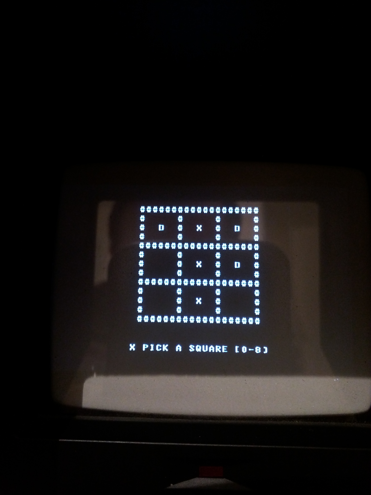
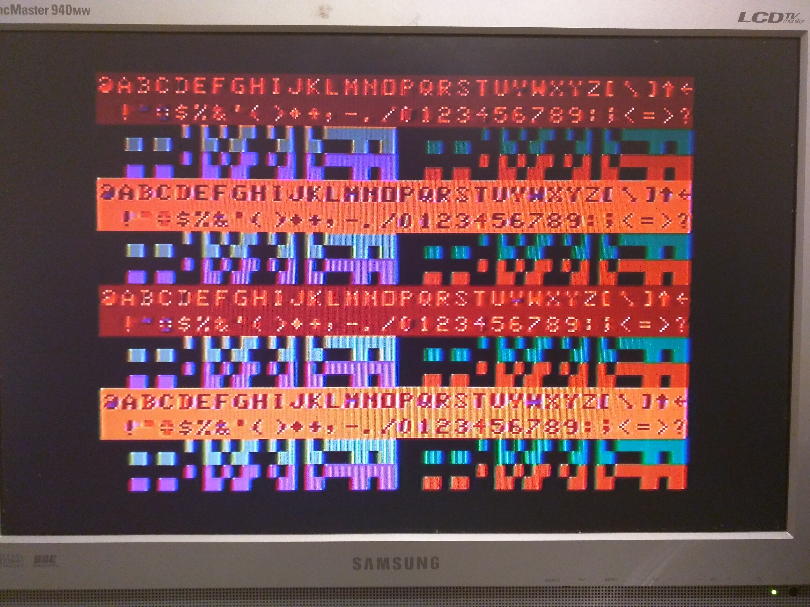

# Z80-Computer
Z80 Computer with MC6847 Video Display Generator

This is a relatively simple Z80 computer, using vintage components.
If it wasn't available in the late 70's, it is not in the design!
I wanted to avoid using very modern parts (arduinos, FPGA's, CPLD's Raspberry Pi's etc) whilst still keeping the design as simple as possible.

